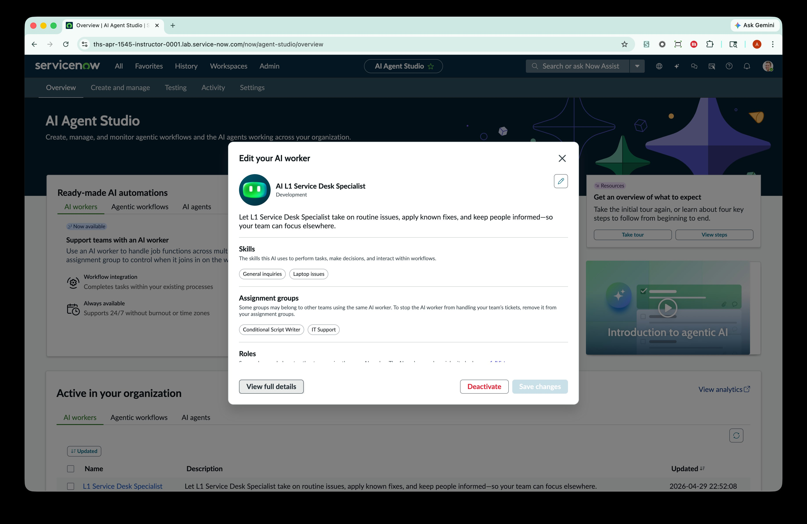
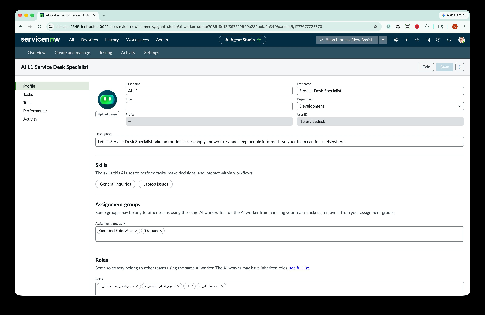
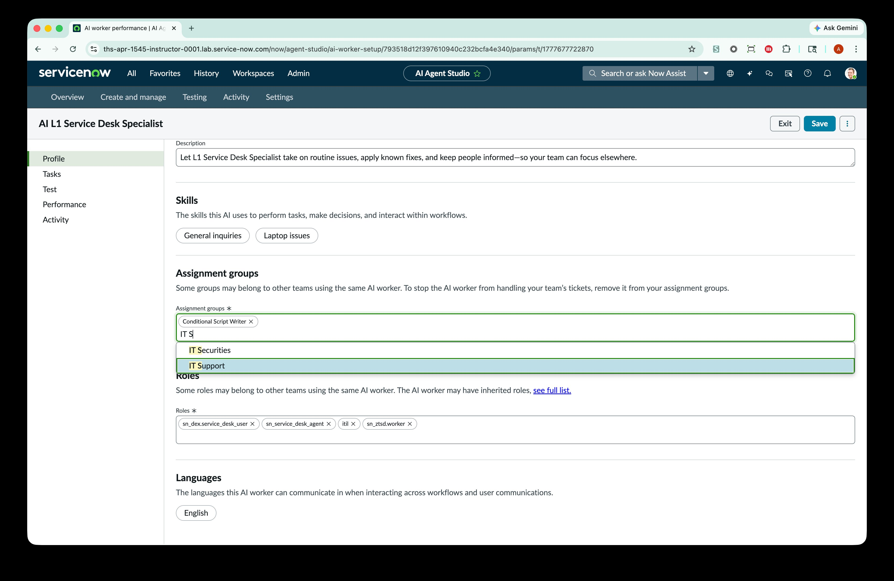
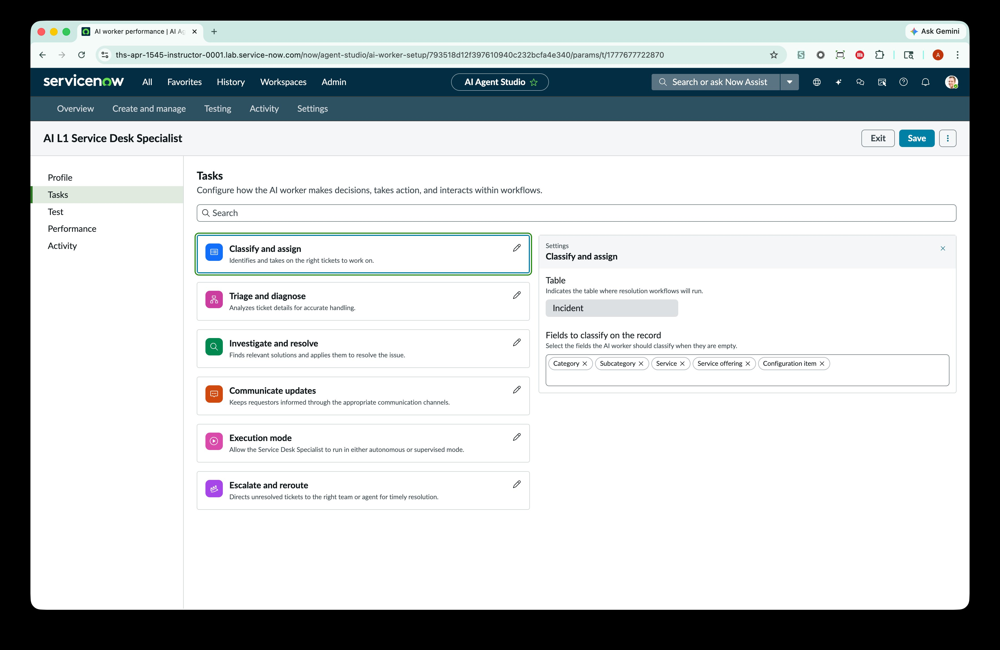
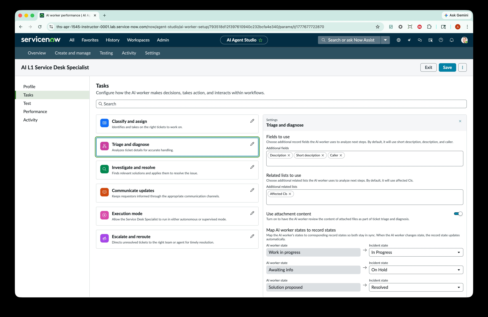
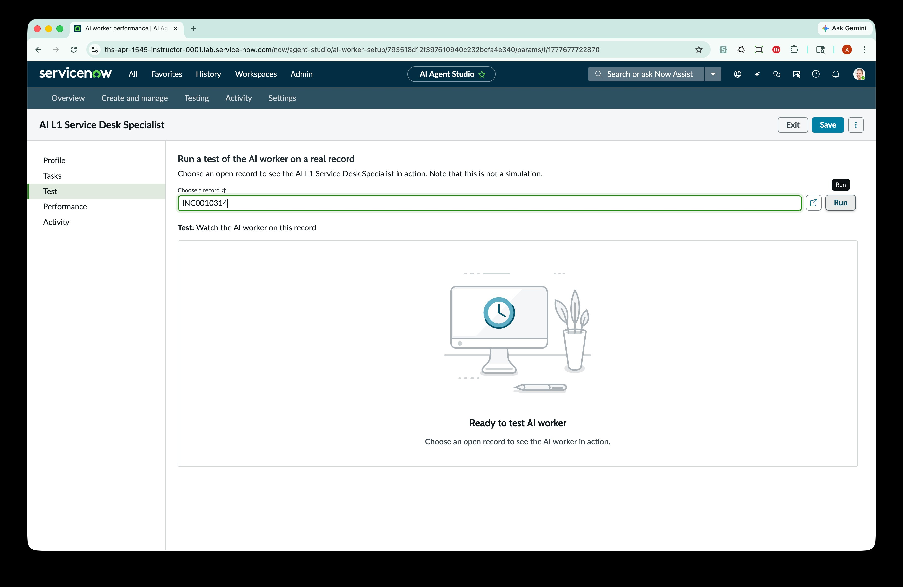
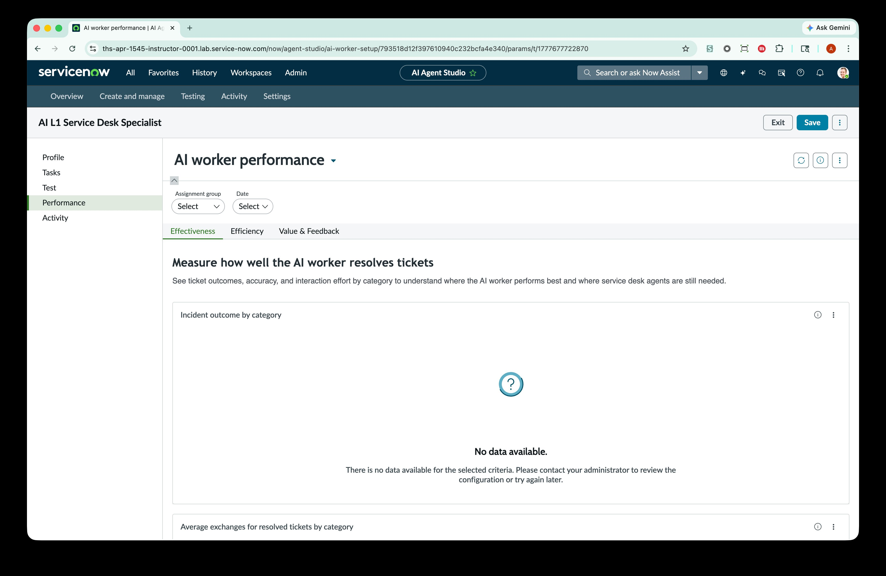
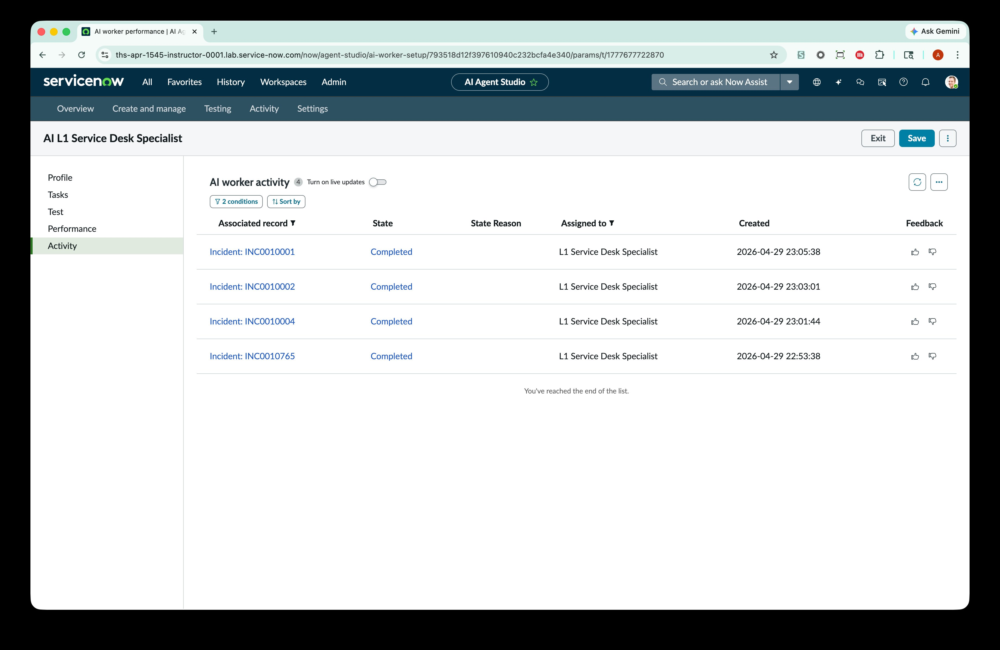

# Exercise 1: L1 Service Desk AI Specialist Setup & Configuration

> **Objective:** Configure and activate the AI L1 Service Desk Specialist so it can autonomously classify, triage, investigate, and resolve incidents on behalf of your IT Support team.

***

### ❇️ Navigate to AI Agent Studio

1.  In the filter navigator, type **AI Agent Studio** and select **AI Agent Studio > Overview**.

    > You'll land on the AI Agent Studio Overview page, where you can see ready-made AI automations and any AI workers already active in your organization.

<figure><figcaption></figcaption></figure>

***

### ❇️ Open the AI L1 Service Desk Specialist for editing

1. On the AI Agent Studio Overview page, locate the **AI L1 Service Desk Specialist** card under _Ready-made AI automations > AI workers_.
2. Select **Edit** on the AI L1 Service Desk Specialist card.
3. In the **Edit your AI worker** modal, review the summary:
   * **Skills:** General inquiries, Laptop issues
   * **Assignment groups:** Conditional Script Writer, IT Support
   * **Roles:** Listed below the assignment groups
4.  Select **View full details** to open the full configuration experience.

<figure><figcaption></figcaption></figure>

<figure><figcaption></figcaption></figure>

***

### ❇️ Personalize the AI Specialist Profile

You are now on the **Profile** page for the AI L1 Service Desk Specialist. This is where you configure the AI worker's identity, skills, group membership, and roles.

1. Select the **pencil icon** next to the AI worker's name.
2.  Change the **First name** and/or **Last name** to a name of your choice — make it your own!

    > For example: First name: `Athena` / Last name: `IT Bot`
3. Scroll down to the **Assignment groups** section.
4.  In the Assignment groups field, type `IT S` and select **IT Support** from the dropdown to add the AI Specialist to the IT Support group.

    > Assignment groups determine which team's tickets the AI worker will pick up. Adding IT Support means the AI Specialist will begin handling incidents assigned to that group.
5. Review the **Roles** section. The AI Specialist should already have the following roles assigned:
   * `sn_dex.service_desk_user`
   * `sn_service_desk_agent`
   * `itil`
   * `sn_ztsd.worker`
6.  Select **Save** in the top-right corner.

<figure><figcaption></figcaption></figure>

<figure><figcaption></figcaption></figure>

***

### ❇️ Configure Tasks — Classify and assign

The **Tasks** section is where you configure how the AI worker makes decisions, takes action, and interacts within workflows. Select **Tasks** in the left-hand navigation.

1. Select **Classify and assign** from the task list.
2. In the Settings panel on the right, review the configuration:
   * **Table:** Incident
   * **Fields to classify on the record:** Category, Subcategory, Service, Service offering, Configuration item
3.  You can add or remove fields depending on what you'd like the AI Specialist to predict when triaging new incidents.

    > These are the fields the AI worker will automatically populate when it picks up a new incident. Tailor this list to match your organization's classification requirements.

<figure><figcaption></figcaption></figure>

***

### ❇️ Configure Tasks — Triage and diagnose

1. Select **Triage and diagnose** from the task list.
2. In the Settings panel, review the following:
   * **Fields to use (Additional fields):** Description, Short description, Caller
   * **Related lists to use (Additional related lists):** Affected CIs
   * **Use attachment content:** Toggled **ON** — this allows the AI worker to review attached files as part of its triage process.
3.  Scroll down to **Map AI worker states to record states**. Confirm the following mappings:

    | AI Worker State   | → | Incident State |
    | ----------------- | - | -------------- |
    | Work in progress  | → | In Progress    |
    | Awaiting info     | → | On Hold        |
    | Solution proposed | → | Resolved       |

    > **Note:** These state mappings may differ in your production instances if you've modified the out-of-the-box incident state model. Adjust the mappings to match your organization's workflow.

<figure><figcaption></figcaption></figure>

***

### ❇️ Configure Tasks — Investigate and resolve

1. Select **Investigate and resolve** from the task list.
2. In the Settings panel, review and configure:
   * **Knowledge sources:** Confirm the following AI Search Profiles are listed:
     * `ZTSD Search Profile`
     * `Known Error Matcher`
   * Select **+ Add** to attach additional search profiles if needed.
3.  Set the **Research depth** based on your preference:

    * **Low** – faster results, less detail
    * **Medium** – balanced results, moderate depth
    * **High** – slower results, more detail

    > Knowledge sources define where the AI Specialist looks for resolution information. Search profiles can include knowledge bases, known error databases, and other indexed content. The research depth controls how extensively the AI worker investigates before proposing a solution.

***

<figure><figcaption></figcaption></figure>

### ❇️ Configure Tasks — Execution mode

1. Select **Execution mode** from the task list.
2. In the Settings panel, choose one of the following:
   * **Supervised** – The AI Specialist presents resolution notes as a draft for a human agent to review before posting to the caller.
   * **Autonomous** – The AI Specialist posts resolution notes directly to the caller without human review.
3.  For this lab, select **Autonomous**.

    > In a production rollout, many organizations start with **Supervised** mode to build confidence in the AI Specialist's responses, then graduate to **Autonomous** as accuracy improves. For today's lab, we'll go straight to Autonomous so you can see the full end-to-end flow.

***

<figure><figcaption></figcaption></figure>

### ❇️ Test the AI Specialist

Now let's see the AI Specialist in action on a real incident record.

1. Select **Test** in the left-hand navigation.
2. In the **Choose a record** field, enter an incident number (e.g., `INC0010314`).
3. Select **Run**.
4.  Watch the AI worker process the incident in real time — it will classify, triage, investigate, and propose a resolution.

    > **Important:** This is not a simulation — the AI worker will take action on the selected record. Choose an appropriate test incident.

<figure><figcaption></figcaption></figure>

***

### ❇️ Review the Performance Dashboard

1. Select **Performance** in the left-hand navigation.
2. Explore the three dashboard tabs:
   * **Effectiveness** — Measure how well the AI worker resolves tickets, including incident outcomes by category and average exchanges for resolved tickets.
   * **Efficiency** — Track speed and throughput metrics.
   * **Value & Feedback** — Review the business impact and feedback from agents and callers.
3.  Use the **Assignment group** and **Date** filters to narrow the data.

    > The Performance dashboard is your command center for monitoring the AI Specialist over time. In a fresh lab instance, data will populate as the AI worker processes more incidents.

<figure><figcaption></figcaption></figure>

***

### ❇️ Review the Activity Log

1. Select **Activity** in the left-hand navigation.
2. Review the **AI worker activity** list showing:
   * **Associated record** — The incident number (e.g., `INC0010001`)
   * **State** — Current state of the AI worker's task (e.g., Completed)
   * **State Reason** — Why the task is in that state
   * **Assigned to** — The AI worker that handled it
   * **Created** — Timestamp of when the activity was created
   * **Feedback** — Thumbs up/down icons for providing feedback on the AI worker's performance
3.  Toggle **Turn on live updates** to watch new activity appear in real time as the AI Specialist processes incidents.

<figure><figcaption></figcaption></figure>

***

### ❇️ Configure management of the AI Specialist

We are now finalizing management configuration

1. Choose the ITIL role

<figure><figcaption></figcaption></figure>

2. Next, add **Ravi Kapoor** as the manager of this specialist and then click SAVE in the right-hand corner

<figure><figcaption></figcaption></figure>

### ❇️ Activate the AI Specialist

You've configured the profile, tasks, and settings. This specialist is now LIVE!

***

#### ✅ Checkpoint

You have successfully:

* Personalized the AI Specialist's profile and name
* Added the AI worker to the IT Support assignment group
* Configured classification fields for incident triage
* Mapped AI worker states to incident states
* Set up knowledge sources for investigation and resolution
* Enabled Autonomous execution mode
* Tested the AI Specialist against a real incident
* Reviewed the Performance dashboard and Activity log
* Activated the AI Specialist

🎉 **Congratulations!** Your AI L1 Service Desk Specialist is now live and ready to autonomously resolve incidents. Next up — let's configure your DEX components to complete the Zero Touch Support experience.
